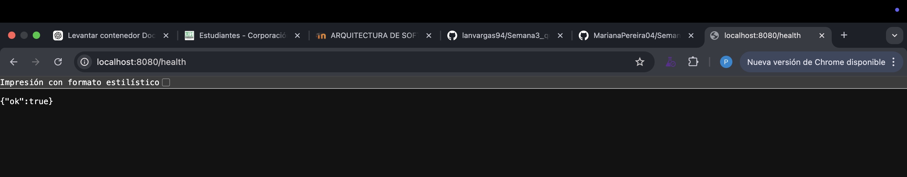

# FASE 1 - Levantamiento del ambiente

Levantamiento exitoso, yeii

# FASE 2 - Auditoria del código

Ahora a partir de los distintos archivos del código se muestra a continuación los hallazgos de problemas encontrados teniendo en cuenta principios Clean Code, SOLID y Seguridad Básica.

# Tabla de Hallazgos — Auditoría Clean Code y Seguridad

| # | Descripción del problema | Archivo | Línea aprox. | Principio violado | Riesgo |
|---|--------------------------|---------|--------------|------------------|--------|
| 1 | Construcción de consulta SQL mediante concatenación de strings (posible SQL Injection) | UserRepository.java | ~20 | Seguridad básica (SQL Injection) | Alto |
| 2 | Inserción SQL con concatenación directa de datos del usuario | UserRepository.java | ~34 | Seguridad básica (SQL Injection) | Alto |
| 3 | Uso de MD5 para hashing de contraseñas (algoritmo inseguro y obsoleto) | AuthService.java | ~63 | Seguridad básica (hashing débil) | Alto |
| 4 | Exposición del hash de la contraseña en la respuesta del login | AuthService.java | ~28 y ~35 | Principio de mínima exposición de datos | Alto |
| 5 | Credenciales de base de datos hardcodeadas en el repositorio | UserRepository.java | ~12-14 | Seguridad / Clean Code | Alto |
| 6 | Atributos públicos en la entidad User (violación de encapsulamiento) | User.java | ~4-6 | Clean Code / OOP | Medio |
| 7 | Controlador usa nombres de parámetros poco descriptivos (u, p, e) | AuthController.java | ~20 y ~27 | Naming (Clean Code) | Bajo |
| 8 | Falta de separación adecuada de responsabilidades en acceso a datos (uso directo de DriverManager) | UserRepository.java | ~17 | SRP / DIP (SOLID) | Medio |
| 9 | No se cierran conexiones, Statements ni ResultSet (posible fuga de recursos) | UserRepository.java | ~16-29 | Buenas prácticas / manejo de recursos | Medio |
| 10 | Validación de contraseña extremadamente débil (solo longitud > 3) | AuthService.java | ~44 | Seguridad básica | Medio |